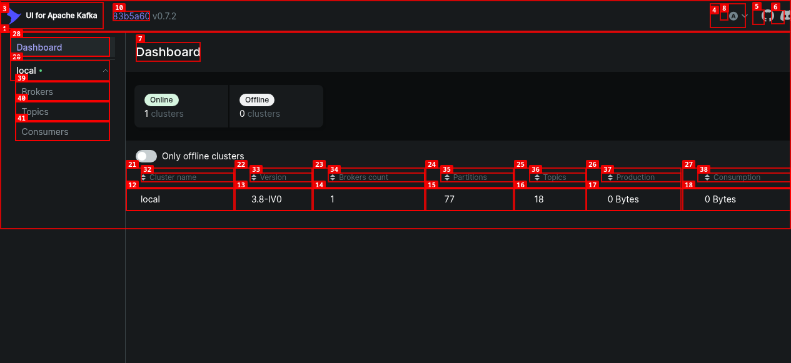
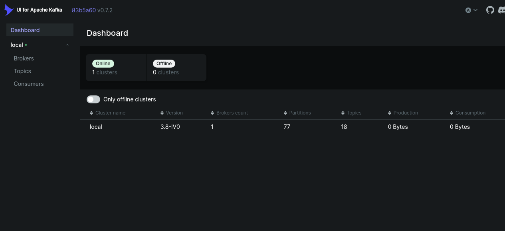
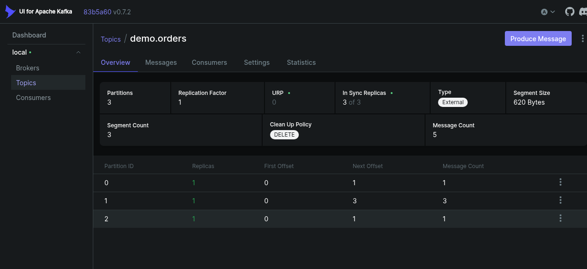
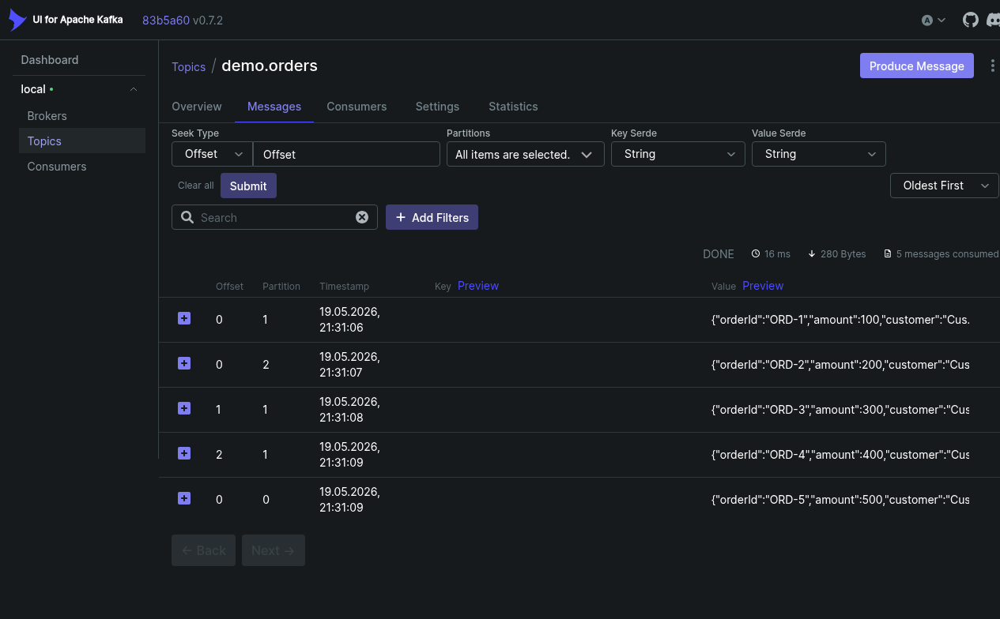
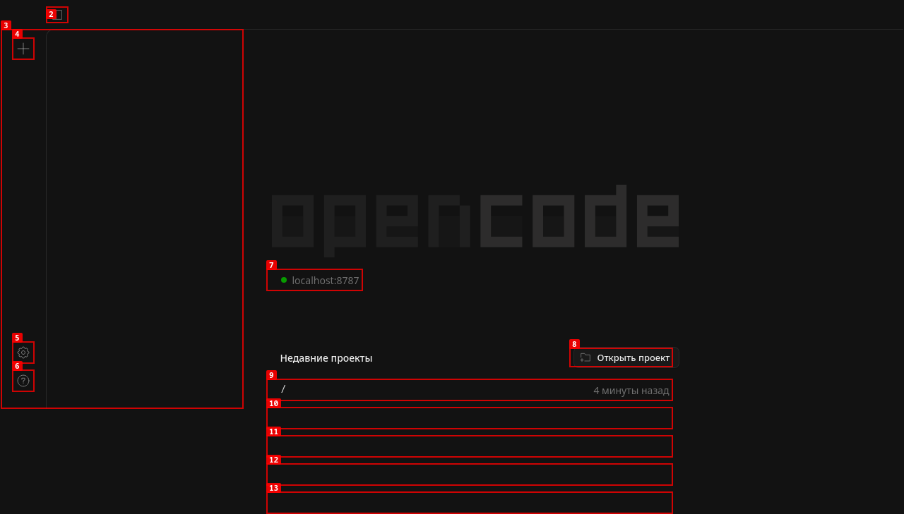

# Руководство по демонстрации opencode-plugin-kafka

## Подготовка демо-стенда

### Шаг 1: Запуск Kafka и Kafka UI

```bash
cd ~/workspase/projects/opencode-plugin-kafka
docker compose -f docker-compose.kafka.yml up -d
```

Подождите 30 секунд для запуска Kafka.

---

### Шаг 2: Открытие Kafka UI

Откройте в браузере:
```
http://localhost:8090
```

**Screenshot 1: Kafka UI Dashboard**



*На dashboard видно: cluster local, 1 broker, 18 topics*

---

### Шаг 3: Просмотр списка топиков

Перейдите в раздел **Topics** в левом меню.

**Screenshot 2: Список топиков**



*Видны все demo-топики: demo.orders, demo.agent-tasks, demo.events, demo.notifications, demo.audit-log*

---

### Шаг 4: Просмотр сообщений в demo.orders

1. Кликните на топик **demo.orders**
2. Перейдите на вкладку **Messages**

**Screenshot 3: Сообщения demo.orders**



*6 сообщений с заказами ORD-1...ORD-5, включая payment event ORD-22363*

---

### Шаг 5: Просмотр сообщений в demo.agent-tasks

1. Вернитесь к списку топиков
2. Кликните на топик **demo.agent-tasks**
3. Перейдите на вкладку **Messages**

**Screenshot 4: Сообщения demo.agent-tasks**



*8 сообщений: 3 task-задачи (TSK-1, TSK-2, TSK-3) и 5 алертов (ALERT-1...ALERT-5)*

---

### Шаг 6: Открытие OpenCode Web

Откройте в браузере:
```
http://localhost:8787
```

**Screenshot 5: OpenCode Web UI**



*Интерфейс OpenCode с проектом opencode-plugin-kafka*

---

## Запуск демо-скриптов

### Шаг 7: Демо JSONPath Rule Matching

```bash
cd ~/workspase/projects/opencode-plugin-kafka
node scripts/demo-jsonpath-rules.mjs
```

**Ожидаемый вывод:**

```
📡 JSONPath Rule Matching — Демонстрация
════════════════════════════════════════════════════════════

🅰️ СЛУЧАЙ 1: Сообщение НЕ отрабатывает (no match)
────────────────────────────────────────────────────────────
📥 Input: {"type":"security-check","alerts":[{"severity":"LOW","msg":"Minor issue detected"}]}
📋 Правило: jsonPath: "$.alerts[?(@.severity==CRITICAL || @.severity==HIGH)]"
✅ РЕЗУЛЬТАТ: NO MATCH → Сообщение в DLQ

🅱️ СЛУЧАЙ 2: Только промт (дефолтный агент)
────────────────────────────────────────────────────────────
📥 Input: {"type":"info","message":"User logged in","user":"john@example.com"}
📋 Правило: jsonPath: "$" (match всех сообщений)
✅ РЕЗУЛЬТАТ: MATCHED → Agent: default-agent
📝 Prompt: Process message: User logged in
✅ Ответ: [Mock] Processed by default-agent

🅾️ СЛУЧАЙ 3: Все поля заполнены (полный флоу)
────────────────────────────────────────────────────────────
📥 Input: {"type":"security-check","alerts":[{"severity":"CRITICAL","msg":"SQL Injection!"}]}
📋 Правило: jsonPath: "$.alerts[?(@.severity==CRITICAL|| @.severity==HIGH)]"
✅ РЕЗУЛЬТАТ: MATCHED → Agent: sec-agent → responseTopic: opencode.responses
📝 Prompt: 🚨 CRITICAL ALERT: [{"severity":"CRITICAL","msg":"SQL Injection!"}]
✅ Ответ: [Mock] Processed by sec-agent
📤 Ответ отправлен в Kafka: topic=opencode.responses
```

---

### Шаг 8: Демо Agent Cases

```bash
node scripts/demo-agent-cases.mjs
```

**Ожидаемый вывод:**

```
╔══════════════════════════════════════════════════════════════╗
║       Kafka Plugin — Демонстрация обработки сообщений      ║
╚══════════════════════════════════════════════════════════════╝

╔══════════════════════════════════════════════════════════════╗
║  КЕЙС 1: Агент вызван, ответ НЕ отправляется            ║
╚══════════════════════════════════════════════════════════════╝
📥 Input: {"action":"LOG","message":"User logged in"}
✅ Matched: log-rule
   agentId: logger-agent
   responseTopic: null → ответ только в логах
📝 Prompt: Log: User logged in
✅ Agent finished: success
⚠️  responseTopic = null → Ответ НЕ отправляется в Kafka
📊 Flow: Message → Agent → (logs only) → commit

╔══════════════════════════════════════════════════════════════╗
║  КЕЙС 2: Агент вызван, ответ → responseTopic            ║
╚══════════════════════════════════════════════════════════════╝
📥 Input: {"type":"process","data":{"orderId":"ORD-123","amount":999.99}}
✅ Matched: process-rule
   agentId: processor-agent
   responseTopic: demo.responses → ЕСТЬ!
📝 Prompt: Process: {"orderId":"ORD-123","amount":999.99}
✅ Agent finished: success
📤 → Kafka topic: demo.responses
✅ Response sent to Kafka!
📊 Flow: Message → Agent → Response → Kafka → commit

╔══════════════════════════════════════════════════════════════╗
║  КЕЙС 3: Агент ошибся → отправляется в DLQ               ║
╚══════════════════════════════════════════════════════════════╝
📥 Input: {"type":"process","data":{"orderId":"ORD-456","amount":1234.56}}
✅ Matched: process-rule
   agentId: error-agent → СИМУЛЯЦИЯ ОШИБКИ!
⏳ Invoking agent...
❌ Agent finished: timeout → Connection timeout after 30s
📤 → DLQ (demo.dlq)
   Error: Agent invoke failed: Connection timeout after 30s
✅ Error sent to DLQ!
📊 Flow: Message → Agent → (error) → DLQ → commit
```

---

## Архитектура плагина

### Data Flow

```
1. Kafka Topic Message
          ↓
2. Parse JSON from message.value
          ↓
3. matchRuleV003(payload, rules)
   - Apply jsonPath expression to payload
   - Return first matching rule or null
          ↓
4. buildPromptV003(rule, payload)
   - Replace ${$.path} placeholders
   - Return final prompt string
          ↓
5. agent.invoke(options)
   - Call OpenCode agent with prompt
   - Apply AbortController timeout
          ↓
   ┌─────────────────────────────────────────────┐
   │ SUCCESS                                    │
   │ → Optional: sendResponse() to responseTopic│
   │ → commit offset                           │
   ├─────────────────────────────────────────────┤
   │ ERROR / TIMEOUT                           │
   │ → sendToDlq() with error                  │
   │ → commit offset                          │
   └─────────────────────────────────────────────┘
```

### Конфигурация правил

```json
{
  "topics": ["demo.orders", "demo.agent-tasks"],
  "rules": [
    {
      "name": "critical-alerts",
      "jsonPath": "$.alerts[?(@.severity==CRITICAL || @.severity==HIGH)]",
      "promptTemplate": "🚨 CRITICAL ALERT: ${$.alerts}",
      "agentId": "sec-agent",
      "responseTopic": "opencode.responses",
      "timeoutMs": 60000,
      "concurrency": 2
    },
    {
      "name": "orders-processing",
      "jsonPath": "$.orderId",
      "promptTemplate": "Process order: ${$.orderId}, amount: ${$.amount}",
      "agentId": "orders-agent",
      "responseTopic": "demo.responses"
    }
  ]
}
```

---

## Ключевые возможности

| Возможность | Описание |
|-------------|----------|
| **JSONPath routing** | Маршрутизация по условиям в payload |
| **Template prompts** | Шаблоны с подстановкой ${$.field} |
| **Multiple agents** | Вызов разных агентов для разных типов сообщений |
| **Response topics** | Опциональная отправка ответов в Kafka |
| **DLQ** | Ошибки/таймауты → Dead Letter Queue |
| **Timeout** | Настраиваемый timeout для каждого правила |
| **Concurrency** | Параллельная обработка сообщений |
| **SSL support** | SSL/SASL аутентификация для Kafka |
| **Retry logic** | Автоматический retry при ошибках |

---

## Проверка SSL соединения

### Генерация тестовых сертификатов

```bash
cd ~/workspase/projects/opencode-plugin-kafka/kafka-ssl

# Создание CA
openssl req -new -x509 -keyout ca-key.pem -out ca-cert.pem -days 365 -nodes

# Создание клиентского сертификата
openssl req -new -keyout client-key.pem -out client.csr -nodes
openssl x509 -req -in client.csr -out client-cert.pem -CA ca-cert.pem -CAkey ca-key.pem -CAcreateserial
```

### Проверка SSL подключения

```bash
openssl s_client -connect localhost:9095 -CAfile kafka-ssl/ca-cert.pem
```

---

## Быстрая справка

| Сервис | URL |
|--------|-----|
| Kafka UI | http://localhost:8090 |
| OpenCode Web | http://localhost:8787 |

| Команда | Описание |
|---------|----------|
| `docker compose -f docker-compose.kafka.yml up -d` | Запуск Kafka |
| `docker compose -f docker-compose.kafka.yml down` | Остановка Kafka |
| `node scripts/demo-jsonpath-rules.mjs` | Демо JSONPath |
| `node scripts/demo-agent-cases.mjs` | Демо обработки |

---

*Демонстрация подготовлена для руководства — opencode-plugin-kafka v0.3.0*