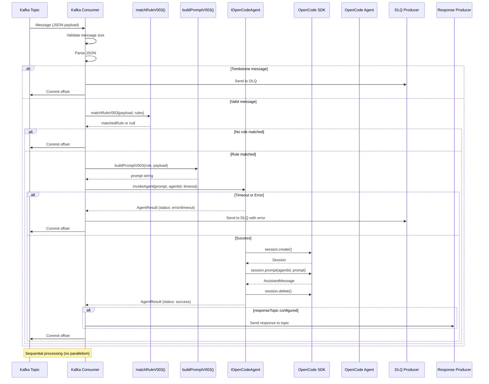
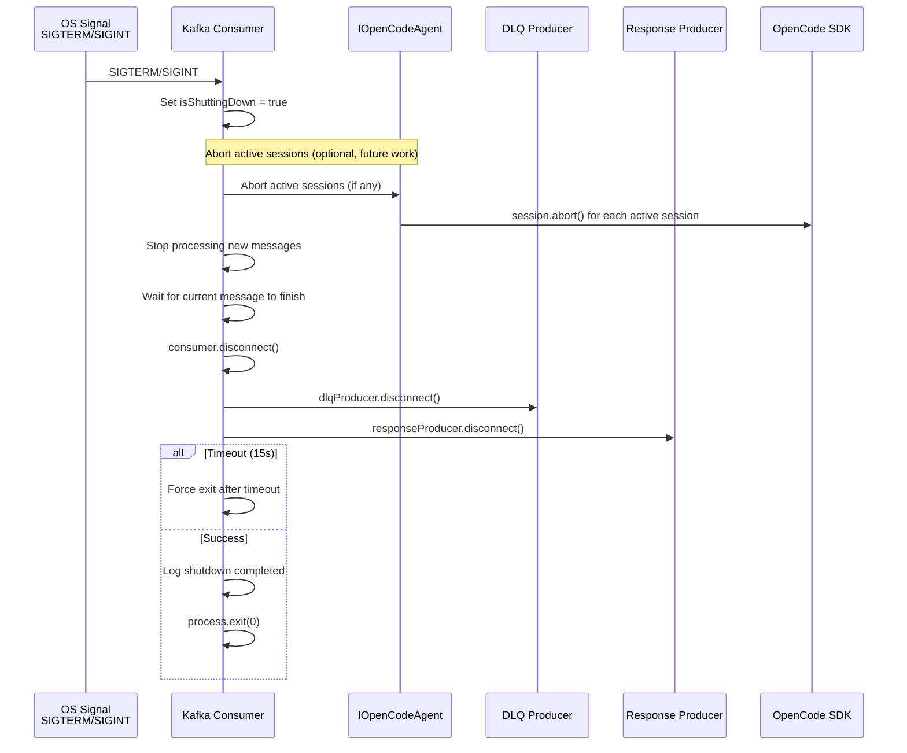

# ADR-006: Архитектурная диаграмма и Final Tradeoffs

## Архитектурная диаграмма

### High-Level Architecture

```mermaid
graph TB
    subgraph "OpenCode Runtime"
        OC[OpenCode Runtime]
        PluginContext[PluginContext<br/>client, project, directory, worktree, $]
        SDK[SDK Client<br/>session.create, session.prompt, session.abort]
    end

    subgraph "Kafka Plugin"
        Entry[plugin()<br/>Entry Point]
        Config[parseConfigV003()<br/>RuleV003Schema validation]
        AgentAdapter[OpenCodeAgentAdapter<br/>implements IOpenCodeAgent]
    end

    subgraph "Kafka Infrastructure"
        Topics[Kafka Topics<br/>input-topic, output-topic, dlq-topic]
        Consumer[Kafka Consumer<br/>eachMessageHandler]
        DLQ[DLQ Producer]
        Response[Response Producer]
    end

    subgraph "OpenCode AI"
        Agents[OpenCode Agents<br/>security-analyzer, code-reviewer, ...]
    end

    OC --> PluginContext
    PluginContext --> SDK

    Entry --> Config
    Entry --> AgentAdapter

    SDK --> AgentAdapter

    Config --> Consumer
    AgentAdapter --> Consumer

    Topics --> Consumer
    Consumer --> DLQ
    Consumer --> Response

    Consumer -->|invokeAgent| AgentAdapter
    AgentAdapter -->|session.create + prompt| SDK
    SDK --> Agents

    Response --> Topics
    DLQ --> Topics

    style PluginContext fill:#e1f5e1
    style AgentAdapter fill:#e1f5e1
    style Consumer fill:#fff4e1
    style Agents fill:#ffe1e1
```

### Message Processing Flow (Each Message)



### Graceful Shutdown Flow



### File Structure (Updated)

```
src/
├── core/
│   ├── config.ts          # parseConfigV003() (без изменений)
│   ├── routing.ts         # matchRuleV003() (без изменений)
│   ├── prompt.ts          # buildPromptV003() (без изменений)
│   └── index.ts           # Re-exports (без изменений)
│
├── kafka/
│   ├── client.ts          # createKafkaClient, createConsumer, createDlqProducer, createResponseProducer (НОВОЕ)
│   ├── consumer.ts        # eachMessageHandler, performGracefulShutdown, startConsumer (ИЗМЕНЕНО)
│   └── dlq.ts             # sendToDlq() (без изменений)
│
├── opencode/              # НОВАЯ ПАПКА
│   ├── IOpenCodeAgent.ts  # Interface IOpenCodeAgent
│   ├── OpenCodeAgentAdapter.ts  # Реализация с SDK client
│   ├── MockOpenCodeAgent.ts     # Mock для тестов
│   └── AgentError.ts      # TimeoutError, AgentError
│
├── types/
│   ├── opencode-plugin.d.ts     # PluginContext, PluginHooks (ИЗМЕНЕНО)
│   └── opencode-sdk.d.ts       # SDK types (НОВОЕ)
│
├── schemas/
│   └── index.ts          # RuleV003Schema (ИЗМЕНЕНО: agentId, responseTopic, timeoutSeconds)
│
└── index.ts               # plugin() entry point (ИЗМЕНЕНО: OpenCodeAgentAdapter)

tests/
├── unit/
│   ├── config.test.ts     # (без изменений, работает)
│   ├── routing.test.ts    # (НОВОЕ: нужно создать)
│   ├── prompt.test.ts    # (НОВОЕ: нужно создать)
│   ├── IOpenCodeAgent.test.ts      # (НОВОЕ)
│   ├── OpenCodeAgentAdapter.test.ts # (НОВОЕ)
│   └── consumer.test.ts   # (НОВОЕ: с mock agent)
│
└── integration/
    └── consumer.integration.test.ts  # (НОВОЕ: с Redpanda + mock agent)
```

## Final Tradeoffs Summary

### 1. Синхронный vs Асинхронный вызов агента

**Решение**: Синхронный blocking вызов

**Tradeoffs**:
- ✅ **Testability**: Easy to write unit tests с predictable flow
- ✅ **Reliability**: At-least-once processing (commit offset после ответа)
- ✅ **Simplicity**: Простой flow, без state management
- ✅ **Constitution compliance**: "No-State Consumer"
- ❌ **Lower throughput**: Блокирует консумер на время выполнения агента
- ❌ **Single message processing**: Нет параллелизма

**Почему выбрано**: Reliability и testability важнее throughput для этого use case

### 2. Commit Offset Timing

**Решение**: Commit offset после получения ответа (или DLQ)

**Tradeoffs**:
- ✅ **At-least-once semantics**: Гарантия обработки
- ✅ **No data loss**: Даже при краше после отправки промпта
- ✅ **Constitution compliance**: "Resiliency"
- ❌ **Potential duplicates**: Possible duplicate processing
- ❌ **Lower throughput**: Блокирует консумер до ответа

**Почему выбрано**: Reliability важнее throughput, duplicates обрабатываются через idempotent agents

### 3. Mockable Interface vs Прямое использование SDK

**Решение**: Mockable interface (IOpenCodeAgent)

**Tradeoffs**:
- ✅ **High testability**: 90%+ coverage achievable
- ✅ **Loose coupling**: Consumer logic не зависит от SDK
- ✅ **Flexibility**: Easy to swap implementations
- ✅ **Centralized timeout handling**
- ❌ **Additional code layer**: ~150-200 lines of code
- ❌ **Interface maintenance overhead**

**Почему выбрано**: Testability и isolation от SDK критичны для проекта

### 4. Response Producer

**Решение**: Optional (только если responseTopic указан)

**Tradeoffs**:
- ✅ **Simplicity**: Для многих use cases достаточно логов
- ✅ **Flexibility**: Пользователь выбирает: логи vs Kafka ответ
- ✅ **Backward compatibility**: Существующие конфиги работают
- ❌ **Optional complexity**: Ещё один producer если нужен
- ❌ **Response send failures**: Errors не отправляются в DLQ

**Почему выбрано**: Flexibility для разных use cases

### 5. Event Hooks

**Решение**: НЕ использовать (пустой объект hooks)

**Tradeoffs**:
- ✅ **Simplicity**: Минимальная сложность
- ✅ **Testability**: Easy to test без моков hooks
- ✅ **Constitution compliance**: "No-State Consumer"
- ✅ **Consistency**: Все ошибки через DLQ
- ❌ **No event visibility**: Не видим события OpenCode напрямую
- ❌ **Limited monitoring**: Меньше инсайтов о работе SDK

**Почему выбрано**: Simplicity first, hooks избыточны для синхронного blocking подхода

### 6. Graceful Shutdown

**Решение**: Abort sessions → disconnect consumer → disconnect producers (15s timeout)

**Tradeoffs**:
- ✅ **Clean shutdown**: Прерывание активных сессий
- ✅ **Cost control**: Не оставляем мёртвые сессии
- ✅ **Graceful**: Даем агентам шанс завершить работу
- ❌ **Timeout complexity**: Additional logic for timeout
- ❌ **Orphan sessions**: Если timeout, могут оставаться orphan сессии

**Почему выбрано**: Clean shutdown важен для cost control и reliability

### 7. Timeout Handling

**Решение**: Promise.race() с TimeoutError

**Tradeoffs**:
- ✅ **Non-blocking**: Не блокирует поток исполнения
- ✅ **Clean error handling**: TimeoutError отделён от других ошибок
- ✅ **Standard pattern**: Common pattern для async timeout
- ❌ **Orphan sessions**: Timeout оставляет активную сессию
- ❌ **Cleanup overhead**: Need background task for orphan cleanup

**Почему выбрано**: Non-blocking timeout критичен для resiliency

## Конституция Compliance Check

### 1. Strict Initialization
- ✅ **Fail-fast**: Невалидная конфигурация падает при старте (Zod validation)
- ✅ **AgentId validation**: Required field в RuleV003Schema

### 2. Domain Isolation
- ✅ **Pure functions**: matchRuleV003, buildPromptV003 — без side effects
- ✅ **Integration layer**: IOpenCodeAgent изолирует consumer logic от SDK

### 3. Resiliency
- ✅ **Try-catch**: В eachMessageHandler для всех ошибок
- ✅ **DLQ**: Ошибки не крашат consumer
- ✅ **Timeout handling**: Promise.race() с TimeoutError
- ✅ **Commit offset after success**: At-least-once semantics

### 4. No-State Consumer
- ✅ **No session state**: Каждое сообщение обрабатывается независимо
- ✅ **No hooks**: Не используем event hooks (избыточно для этого сценария)
- ✅ **Sequential processing**: Следующее сообщение начинается после завершения текущего

### 5. Test-First Development
- ✅ **Mockable interface**: IOpenCodeAgent позволяет мокать SDK
- ✅ **90%+ coverage**: Достижимо через unit tests с mock agent
- ✅ **Unit tests для pure functions**: matchRuleV003, buildPromptV003

## Backward Compatibility

### Breaking Changes
❌ **RuleV003Schema**: Добавлены обязательные поля (agentId)
- **Impact**: Существующие конфиги без agentId не валидны
- **Mitigation**: Clear migration guide, fail-fast at startup

### Non-Breaking Changes
✅ **responseTopic**: Optional field, backward compatible
✅ **timeoutSeconds**: Optional field с default, backward compatible
✅ **Consumer logic**: Расширено, но сохраняет существующий flow
✅ **DLQ**: Без изменений

## Следующие шаги

### Implementation Priority (в порядке важности)

1. **Phase 1: Types and Schemas**
   - Создать `src/types/opencode-sdk.d.ts`
   - Обновить `src/types/opencode-plugin.d.ts`
   - Обновить `src/schemas/index.ts` с RuleV003Schema (agentId, responseTopic, timeoutSeconds)
   - **Estimated time**: 2-3 часа

2. **Phase 2: Integration Layer**
   - Создать `src/opencode/IOpenCodeAgent.ts`
   - Создать `src/opencode/OpenCodeAgentAdapter.ts`
   - Создать `src/opencode/MockOpenCodeAgent.ts`
   - Создать `src/opencode/AgentError.ts`
   - **Estimated time**: 4-6 часов

3. **Phase 3: Consumer Integration**
   - Обновить `src/kafka/consumer.ts` (eachMessageHandler, performGracefulShutdown, startConsumer)
   - Обновить `src/kafka/client.ts` (createResponseProducer)
   - Обновить `src/index.ts` (plugin() с OpenCodeAgentAdapter)
   - **Estimated time**: 3-4 часа

4. **Phase 4: Tests**
   - Создать unit tests для IOpenCodeAgent, OpenCodeAgentAdapter, MockOpenCodeAgent
   - Создать unit tests для consumer (с mock agent)
   - Создать unit tests для routing, prompt (отсутствуют!)
   - Создать integration tests для consumer (Redpanda + mock agent)
   - **Estimated time**: 6-8 часов

**Total estimated time**: 15-21 часов (2-3 дня работы)

### Migration Guide

```json
// Старый формат (spec 003 без OpenCode)
{
  "topics": ["input-topic"],
  "rules": [
    {
      "name": "vuln-rule",
      "jsonPath": "$.vulnerabilities[?(@.severity==\"CRITICAL\")]",
      "promptTemplate": "Analyze: ${$}"
    }
  ]
}

// Новый формат (с OpenCode integration)
{
  "topics": ["input-topic"],
  "rules": [
    {
      "name": "vuln-rule",
      "jsonPath": "$.vulnerabilities[?(@.severity==\"CRITICAL\")]",
      "promptTemplate": "Analyze: ${$}",
      "agentId": "security-analyzer",        // ← ОБЯЗАТЕЛЬНОЕ ПОЛЕ
      "responseTopic": "output-topic",        // ← опциональное
      "timeoutSeconds": 120                   // ← опциональное (default: 120)
    }
  ]
}
```

## Open Questions for User

1. **AgentId default**: Нужен ли default agentId если пользователь не указал?
   - *Recommendation*: Нет, fail-fast при startup (Constitution Principle I)

2. **Timeout default**: 120 секунд (2 минуты) достаточно? Или нужно меньше/больше?
   - *Recommendation*: Оставить 120, сделать конфигурируемым

3. **Response format**: Какой формат ответа для responseTopic? Текущий: JSON с sessionId, ruleName, agentId, response, status, executionTimeMs, timestamp
   - *Recommendation*: Оставить текущий, добавить возможность настройки через template в будущем

4. **Concurrent message processing**: Нужно ли разрешить параллельную обработку сообщений (через max concurrent sessions)?
   - *Recommendation*: Нет в первой версии. Sequential processing обеспечивает backpressure и соблюдение "No-State Consumer". Можно добавить в будущем если нужно.

5. **Orphan sessions cleanup**: Нужно ли background task для очистки orphan сессий при timeout?
   - *Recommendation*: Да, создать в будущем. orphan sessions могут накапливаться при частых timeouts.

6. **Response send retries**: Нужно ли retry при ошибке отправки ответа в responseTopic?
   - *Recommendation*: Нет. Логируем ошибки, ответ не критичен для обработки.

7. **Integration tests**: Нужно ли интеграционные тесты с реальным OpenCode SDK (а не mock)?
   - *Recommendation*: Опционально. Unit tests с mock agent достаточны для 90%+ coverage. Интеграционные с real SDK можно добавить для validation.
